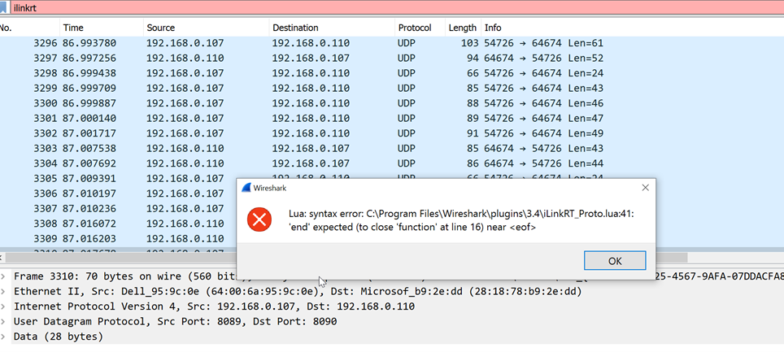

# Plugin to to dissect iLinkRT protocol frames using Wireshark

The iLinkRT_Proto.lua dissector enables Wireshark to dissect iLinkRT frames.

By this it is easy possible to interpret iLinkRT command requests (CTO) and iLinkRT event and data telegrams (DTO).
The iLinkRT frame detection can be done either by specific ports or by a heuristic checker.

Based on:
- Wireshark 3.0
- ASAM iLinkRT V3.0.0


# Usage

## Setup

If you go to **Help** –> **About Wireshark** –> **Folders**, you’ll find all the folders Wireshark reads Lua scripts from.
Choose either the **Personal Lua Plugins**, **Global Lua Plugins** or **Personal configuration** folder.
E.g. `C:\Program Files\Wireshark\plugins\<version>` on Windows.

The script will be active when Wireshark is started.
You have to restart Wireshark after you do changes to the script, or reload all the Lua scripts with *Ctrl+Shift+L*.


## Setting up the boilerplate code

Let’s start by setting up some of the boilerplate code that’s needed in all dissectors:

```
-- iLinkRT_Proto.lua
-- Uses V3.0 of the ILinkRT specification
--
iLinkRT_protocol = Proto("iLinkRT", "iLinkRT Protocol")
iLinkRT_protocol.fields = {}

function iLinkRT_protocol.dissector(buffer, pinfo, tree)
 length = buffer:len()
 if length == 0 then return end

 pinfo.cols.protocol = iLinkRT_protocol.name

 local subtree = tree:add(iLinkRT_protocol, buffer(), "iLinkRT Protocol
 Data")
end

local udp_port = DissectorTable.get("udp.port")
udp_port:add(8090, iLinkRT_protocol)
```

We start my creating a Proto (`protocol`) object and call it `iLinkRT_protocol`.
The table constructor takes two arguments: name and description.
The protocol requires a fields table and a dissector function.
We haven’t added any fields yet, so the fields table is empty.
The dissector function is called once for every packet of our type.

The dissector function has three parameters: `buffer`, `pinfo` and `tree`.
`buffer` contains the packet’s buffer and is a Tvb object.
It contains the data we want to dissect.
`pinfo` contains the columns of the packet list and is a Pinfo object.
Finally, `tree` is the tree root and is a TreeItem object.


Inside the dissector function, we start by checking the length of the buffer and then returning if it’s empty.

As mentioned before, the `pinfo` object contains the columns in the packet list.
We can use it to set the protocol name when we receive a packet of iLinkRT type.
On the script’s first line we set the name of the protocol to be “iLinkRT” (by passing the name to the constructor).
We set the protocol column name here.
```
pinfo.cols.protocol = mongodb_protocol.name
```
and the protocol column name changes from TCP to ILINKRT:

We must then create a sub tree in the tree structure found in the Packet Details pane.
It done by adding an additional tree item to the `tree` object that was passed as an argument to the dissector function.

```
local subtree = tree:add(iLinkRT_protocol, buffer(), "iLinkRT Protocol Data")
```

Finally, we must assign the protocol to a port.
In my case, I’ll use port 8090, because that’s the port I use to connect to the Mongo database.

```
local udp_port = DissectorTable.get("udp.port")
udp_port:add(8090, iLinkRT_protocol)
```

## Adding fields
The script already runs at this stage, but it isn’t doing anything useful.
For the script to do something useful we have to add the fields that we want to parse.
Fields are made by creating ProtoField objects.
We can start off simple by adding only the first field.
The first field in the iLinkRT protocol specification is the message length, which is an int16.

```
-- iLinkRT_Proto.lua
-- Uses V3.0 of the ILinkRT specification
--
iLinkRT_protocol = Proto("iLinkRT",  "iLinkRT Protocol")

message_length = ProtoField.int16("ilinkrt.message_length", "messageLength", base.DEC)

iLinkRT_protocol.fields = {message_length}

function iLinkRT_protocol.dissector(buffer, pinfo, tree)
  length = buffer:len()
  if length == 0 then return end

  pinfo.cols.protocol = iLinkRT_protocol.name

  local subtree = tree:add(iLinkRT_protocol, buffer(), "iLinkRT Protocol Data")

  subtree:add_le(message_length, buffer(0,2))
end

local udp_port = DissectorTable.get("udp.port")
udp_port:add(8090, iLinkRT_protocol)
```

We add the following above the dissector function:
```
message_length = ProtoField.int16("ilinkrt.message_length", "messageLength", base.DEC)
```

The first argument is used as a label in the filter settings, second is used as a label in the sub tree and the last is used to decide how the variable’s value should be displayed.
In this case I want to show the value in decimal, but I could also use base.HEX to show it in hexadecimal format.
Hexadecimal format doesn’t work for int32 though.

ProtoField has several types of functions we can use: uint8(), uint16(), string() and so on.
We have to use the one that matches the specification.
A list of all the functions can be found [here](https://www.wireshark.org/docs/wsdg_html_chunked/lua_module_Proto.html#lua_fn_ProtoField_char_abbr___name____base____valuestring____mask____desc__).

We then add the field to the fields table of the protocol:

```
iLinkRT_protocol.fields = {message_length}
```

and finally add the field to the sub tree:
```
subtree:add_le(message_length, buffer(0,2))
```

I use add_le rather than add, because we are working with a little-endian protocol.
If the protocol was big endian we would have to use add.
The function takes two arguments: the field we made further up, and a buffer range.
We can get a range of the buffer by using the range function that is a part of the buffer object.
buffer(offset,length) is the short form for the range function.
buffer(0,2) means we want to start at the first byte, and then take 2 bytes.
The reason we want to start at 0 is because we’re dealing with the first field in the header.
We take 2 bytes because that is the size of an int16.


## Debugging

When I’m talking about debugging I am not really thinking of debugging the normal way, where you use a symbolic debugger to step through code.
You won’t do that here.
I am rather thinking about the process of finding and fixing errors in the code.
There are generally three ways to debug dissectors written in Lua.

The first is to check if you get any error messages during startup of the script.
This happens either when you start Wireshark or when you reload the script with **Ctrl**+**Shift**+**L**.
Syntax errors in the script will be caught this way.
Here is what an error message looks like when an end statement is missing:



Runtime errors are often shown in the sub tree for the dissector.
For example, if a function is called with the wrong name the error message will look like this.


Finally, Wireshark has a Lua console built in that you can print error messages to.
It’s found in the **Tools** → **Lua** menu.
Wireshark has a function called print() that can be used for logging.
So the following code:

```
print ("Number of messages: " .. num_of_msg)
```
will end up looking like this when printed to the console:


where `..` is used for string concatenation.


## Extending the iLinkRT protocol dissector

In the previous post we made a dissector that ended up looking like this in the packet details pane:


The Command code is only a number.
It would be nicer if we showed the opcode name too.
According to the iLinkRT wire protocol, the Command code have the following names:

Command HEX | Command DEC | Command Name
----------- | ----------- | -------------
FFFF        | 	65535     |  	RT_GET_ALL_SERV
0100        | 	256       |  	RT_GET_SERVER_STATE
0101        | 	257       |  	RT_GET_SERVER_TIME
0102        | 	258       |  	RT_SERVER_CONNECT
0103        | 	259       |  	RT_SERVER_DISCONNECT
0200        | 	512       |  	RT_GET_CALPAGE_INFO
0201        | 	513       |  	RT_GET_CHARACTERISTIC_ID_LIST
0202        | 	514       |  	RT_GET_CHARACTERISTIC_INFO
0203        | 	515       |  	RT_GET_DAQ_RESOLUTION_INFO
0204        | 	516       |  	RT_GET_DEVICE_INFO
0205        | 	517       |  	RT_GET_DEVICE_STATE
0206        | 	518       |  	RT_GET_MEASUREMENT_ID_LIST
0207        | 	519       |  	RT_GET_MEASUREMENT_INFO
0208        | 	520       |  	RT_GET_RASTER_OVERVIEW
0209        | 	521       |  	RT_GET_SELECTED_DEVICES
0300        | 	768       |  	RT_CHANGE_DESCRIPTION_FILE
0301        | 	769       |  	RT_CHANGE_HEX_FILE
0302        | 	770       |  	RT_CONFIGURE_SERVER
0303        | 	771       |  	RT_COPY_DATA_EXCHANGE_FILE_TO_DEVICE
0304        | 	772       |  	RT_DEVICE_CONNECT
0305        | 	773       |  	RT_DISTRIBUTE_EVENT
0306        | 	774       |  	RT_SAVE_HEX_FILE
0307        | 	775       |  	RT_SELECT_CHARACTERISTIC_ID
0308        | 	776       |  	RT_SELECT_DEVICE
0309        | 	777       |  	RT_SELECT_DEVICE_SET
030A        | 	778       |  	RT_SELECT_MEASUREMENT_ID
0400        | 	1024      |  	RT_CLEAR_MEASURING_LIST
0401        | 	1025      |  	RT_CONFIGURE_MEASURING
0402        | 	1026      |  	RT_GET_DAQ_EVENT_INFO
0403        | 	1027      |  	RT_GET_DAQ_MEASUREMENT_LIST
0404        | 	1028      |  	RT_GET_DEVICE_DAQ_LIST
0405        | 	1029      |  	RT_START_STOP_MEASURING
0500        | 	1030      |  	RT_GET_CALPAGE
0501        | 	1031      |  	RT_READ_CELL_VALUES
0502        | 	1032      |  	RT_READ_CHARACTERISTIC
0503        | 	1033      |  	RT_SET_CALPAGE
0504        | 	1034      |  	RT_WRITE_CELL_VALUES
0505        | 	1035      |  	RT_WRITE_CHARACTERISTIC
0600        | 	1536      |  	RT_ADD_KEY_VALUE_PAIR_TO_RECORDER_FILE
0601        | 	1537      |  	RT_CONFIGURE_RECORDER
0602        | 	1538      |  	RT_CONTROL_RECORDER
0603        | 	1539      |  	RT_GET_RETRIGGERING
0604        | 	1540      |  	RT_GET_TRIGGER
0605        | 	1541      |  	RT_SET_CLIENT_BOOKMARK
0606        | 	1542      |  	RT_SET_RETRIGGERING
0607        | 	1543      |  	RT_SET_TRIGGER
0700        | 	1792      |  	RT_EXECUTE_SERVICE
0701        | 	1793      |  	RT_ GET_AVAILABLE_CHARACTERISTICS
0702        | 	1794      |  	RT_ GET_AVAILABLE_DEVICE_SETS
0703        | 	1795      |  	RT_ GET_AVAILABLE_DEVICES
0704        | 	1796      |  	RT_ GET_AVAILABLE_MEASUREMENTS

To grab the command as an integer we can use

```
local cmd = buffer(8,2):le_uint()
```
le_int() gets a little endian int from the buffer range.
The variable cmd now contains an int representing the command in decimal.
We can then make a function that returns the command name given the command number:

```
function get_cmd_name(cmd)
    local cmd_name = "Unknown"

    if cmd == 65535 then cmd_name = "RT_GET_ALL_SERVER"
    elseif cmd == 256   then cmd_name = "RT_GET_SERVER_STATE"
    elseif cmd == 257   then cmd_name = "RT_GET_SERVER_TIME"
    elseif cmd == 258   then cmd_name = "RT_SERVER_CONNECT"
    elseif cmd == 259   then cmd_name = "RT_SERVER_DISCONNECT"
    elseif cmd == 512   then cmd_name = "RT_GET_CALPAGE_INFO"
    elseif cmd == 513   then cmd_name = "RT_GET_CHARACTERISTIC_ID_LIST"
    elseif cmd == 514   then cmd_name = "RT_GET_CHARACTERISTIC_INFO"
    elseif cmd == 515   then cmd_name = "RT_GET_DAQ_RESOLUTION_INFO"
    elseif cmd == 516   then cmd_name = "RT_GET_DEVICE_INFO"
    elseif cmd == 517   then cmd_name = "RT_GET_DEVICE_STATE"
    elseif cmd == 518   then cmd_name = "RT_GET_MEASUREMENT_ID_LIST"
    elseif cmd == 519   then cmd_name = "RT_GET_MEASUREMENT_INFO"
    elseif cmd == 520   then cmd_name = "RT_GET_RASTER_OVERVIEW"
    elseif cmd == 521   then cmd_name = "RT_GET_SELECTED_DEVICES"
    elseif cmd == 768   then cmd_name = "RT_CHANGE_DESCRIPTION_FILE"
    elseif cmd == 769   then cmd_name = "RT_CHANGE_HEX_FILE"
    elseif cmd == 770   then cmd_name = "RT_CONFIGURE_SERVER"
    elseif cmd == 771   then cmd_name = "RT_COPY_DATA_EXCHANGE_FILE_TO_DEVICE"
    elseif cmd == 772   then cmd_name = "RT_DEVICE_CONNECT"
    elseif cmd == 773   then cmd_name = "RT_DISTRIBUTE_EVENT"
    elseif cmd == 774   then cmd_name = "RT_SAVE_HEX_FILE"
    elseif cmd == 775   then cmd_name = "RT_SELECT_CHARACTERISTIC_ID"
    elseif cmd == 776   then cmd_name = "RT_SELECT_DEVICE"
    elseif cmd == 777   then cmd_name = "RT_SELECT_DEVICE_SET"
    elseif cmd == 778   then cmd_name = "RT_SELECT_MEASUREMENT_ID"
    elseif cmd == 1024  then cmd_name = "RT_CLEAR_MEASURING_LIST"
    elseif cmd == 1025  then cmd_name = "RT_CONFIGURE_MEASURING"
    elseif cmd == 1026  then cmd_name = "RT_GET_DAQ_EVENT_INFO"
    elseif cmd == 1027  then cmd_name = "RT_GET_DAQ_MEASUREMENT_LIST"
    elseif cmd == 1028  then cmd_name = "RT_GET_DEVICE_DAQ_LIST"
    elseif cmd == 1029  then cmd_name = "RT_START_STOP_MEASURING"
    elseif cmd == 1030  then cmd_name = "RT_GET_CALPAGE"
    elseif cmd == 1031  then cmd_name = "RT_READ_CELL_VALUES"
    elseif cmd == 1032  then cmd_name = "RT_READ_CHARACTERISTIC"
    elseif cmd == 1033  then cmd_name = "RT_SET_CALPAGE"
    elseif cmd == 1034  then cmd_name = "RT_WRITE_CELL_VALUES"
    elseif cmd == 1035  then cmd_name = "RT_WRITE_CHARACTERISTIC"
    elseif cmd == 1536  then cmd_name = "RT_ADD_KEY_VALUE_PAIR_TO_RECORDER_FILE"
    elseif cmd == 1537  then cmd_name = "RT_CONFIGURE_RECORDER"
    elseif cmd == 1538  then cmd_name = "RT_CONTROL_RECORDER"
    elseif cmd == 1539  then cmd_name = "RT_GET_RETRIGGERING"
    elseif cmd == 1540  then cmd_name = "RT_GET_TRIGGER"
    elseif cmd == 1541  then cmd_name = "RT_SET_CLIENT_BOOKMARK"
    elseif cmd == 1542  then cmd_name = "RT_SET_RETRIGGERING"
    elseif cmd == 1543  then cmd_name = "RT_SET_TRIGGER"
    elseif cmd == 1792  then cmd_name = "RT_EXECUTE_SERVICE"
    elseif cmd == 1793  then cmd_name = "RT_ GET_AVAILABLE_CHARACTERISTICS"
    elseif cmd == 1794  then cmd_name = "RT_ GET_AVAILABLE_DEVICE_SETS"
    elseif cmd == 1795  then cmd_name = "RT_ GET_AVAILABLE_DEVICES"
    elseif cmd == 1796  then cmd_name = "RT_ GET_AVAILABLE_MEASUREMENTS"
    end

	return cmd_name
end
```

Finally, we have to replace the old addition to the sub tree with the following code:

```
local cmd_name = get_cmd_name(cmd)
    subtree:add_le(command, buffer(8,2)):append_text(" (" .. cmd_name .. ")")

```

We append the name of the name of the command in parentheses to the original statement that only showed command number.
The packet details pane in Wireshark will then end up looking like this:


```
-- iLinkRT_Proto.lua
-- Uses V3.0 of the ILinkRT specification
--
iLinkRT_protocol = Proto("iLinkRT",  "iLinkRT Protocol")

message_length = ProtoField.int16("ilinkrt.message_length", "messageLength", base.DEC)
message_ctr = ProtoField.int16("ilinkrt.message_ctr", "messageCounter", base.DEC)
message_cf1 = ProtoField.int16("ilinkrt.message_cf1", "messageFirstControl", base.DEC)
message_fill1 = ProtoField.int16("ilinkrt.message_fill1", "messagefillBytes", base.DEC)
message_cf2 = ProtoField.int16("ilinkrt.message_cf2", "messageSecondControl", base.DEC)
command = ProtoField.int16("ilinkrt.command", "command", base.DEC)

num_of_msg = 0

iLinkRT_protocol.fields = {message_length, message_ctr, message_cf1, message_fill1, message_cf2, command  }

function iLinkRT_protocol.dissector(buffer, pinfo, tree)
  length = buffer:len()
  if length == 0 then return end


  --num_of_msg = num_of_msg +1
  --print ("Number of messages: " .. num_of_msg)


  pinfo.cols.protocol = iLinkRT_protocol.name

  local subtree = tree:add(iLinkRT_protocol, buffer(), "iLinkRT Protocol Data")

  subtree:add_le(message_length, buffer(0,2))
  subtree:add_le(message_ctr, buffer(2,2))
  subtree:add_le(message_cf1, buffer(4,2))
  subtree:add_le(message_fill1, buffer(6,2))
  subtree:add_le(message_cf2, buffer(length-2,2))

  local cmd = buffer(8,2):le_uint()
  local cmd_name = get_cmd_name(cmd)
  subtree:add_le(command, buffer(8,2)):append_text(" (" .. cmd_name .. ")")

end


function get_cmd_name(cmd)
    local cmd_name = "Unknown"

    if cmd == 65535 then cmd_name = "RT_GET_ALL_SERVER"
    elseif cmd == 256   then cmd_name = "RT_GET_SERVER_STATE"
    elseif cmd == 257   then cmd_name = "RT_GET_SERVER_TIME"
    elseif cmd == 258   then cmd_name = "RT_SERVER_CONNECT"
    elseif cmd == 259   then cmd_name = "RT_SERVER_DISCONNECT"
    elseif cmd == 512   then cmd_name = "RT_GET_CALPAGE_INFO"
    elseif cmd == 513   then cmd_name = "RT_GET_CHARACTERISTIC_ID_LIST"
    elseif cmd == 514   then cmd_name = "RT_GET_CHARACTERISTIC_INFO"
    elseif cmd == 515   then cmd_name = "RT_GET_DAQ_RESOLUTION_INFO"
    elseif cmd == 516   then cmd_name = "RT_GET_DEVICE_INFO"
    elseif cmd == 517   then cmd_name = "RT_GET_DEVICE_STATE"
    elseif cmd == 518   then cmd_name = "RT_GET_MEASUREMENT_ID_LIST"
    elseif cmd == 519   then cmd_name = "RT_GET_MEASUREMENT_INFO"
    elseif cmd == 520   then cmd_name = "RT_GET_RASTER_OVERVIEW"
    elseif cmd == 521   then cmd_name = "RT_GET_SELECTED_DEVICES"
    elseif cmd == 768   then cmd_name = "RT_CHANGE_DESCRIPTION_FILE"
    elseif cmd == 769   then cmd_name = "RT_CHANGE_HEX_FILE"
    elseif cmd == 770   then cmd_name = "RT_CONFIGURE_SERVER"
    elseif cmd == 771   then cmd_name = "RT_COPY_DATA_EXCHANGE_FILE_TO_DEVICE"
    elseif cmd == 772   then cmd_name = "RT_DEVICE_CONNECT"
    elseif cmd == 773   then cmd_name = "RT_DISTRIBUTE_EVENT"
    elseif cmd == 774   then cmd_name = "RT_SAVE_HEX_FILE"
    elseif cmd == 775   then cmd_name = "RT_SELECT_CHARACTERISTIC_ID"
    elseif cmd == 776   then cmd_name = "RT_SELECT_DEVICE"
    elseif cmd == 777   then cmd_name = "RT_SELECT_DEVICE_SET"
    elseif cmd == 778   then cmd_name = "RT_SELECT_MEASUREMENT_ID"
    elseif cmd == 1024  then cmd_name = "RT_CLEAR_MEASURING_LIST"
    elseif cmd == 1025  then cmd_name = "RT_CONFIGURE_MEASURING"
    elseif cmd == 1026  then cmd_name = "RT_GET_DAQ_EVENT_INFO"
    elseif cmd == 1027  then cmd_name = "RT_GET_DAQ_MEASUREMENT_LIST"
    elseif cmd == 1028  then cmd_name = "RT_GET_DEVICE_DAQ_LIST"
    elseif cmd == 1029  then cmd_name = "RT_START_STOP_MEASURING"
    elseif cmd == 1030  then cmd_name = "RT_GET_CALPAGE"
    elseif cmd == 1031  then cmd_name = "RT_READ_CELL_VALUES"
    elseif cmd == 1032  then cmd_name = "RT_READ_CHARACTERISTIC"
    elseif cmd == 1033  then cmd_name = "RT_SET_CALPAGE"
    elseif cmd == 1034  then cmd_name = "RT_WRITE_CELL_VALUES"
    elseif cmd == 1035  then cmd_name = "RT_WRITE_CHARACTERISTIC"
    elseif cmd == 1536  then cmd_name = "RT_ADD_KEY_VALUE_PAIR_TO_RECORDER_FILE"
    elseif cmd == 1537  then cmd_name = "RT_CONFIGURE_RECORDER"
    elseif cmd == 1538  then cmd_name = "RT_CONTROL_RECORDER"
    elseif cmd == 1539  then cmd_name = "RT_GET_RETRIGGERING"
    elseif cmd == 1540  then cmd_name = "RT_GET_TRIGGER"
    elseif cmd == 1541  then cmd_name = "RT_SET_CLIENT_BOOKMARK"
    elseif cmd == 1542  then cmd_name = "RT_SET_RETRIGGERING"
    elseif cmd == 1543  then cmd_name = "RT_SET_TRIGGER"
    elseif cmd == 1792  then cmd_name = "RT_EXECUTE_SERVICE"
    elseif cmd == 1793  then cmd_name = "RT_ GET_AVAILABLE_CHARACTERISTICS"
    elseif cmd == 1794  then cmd_name = "RT_ GET_AVAILABLE_DEVICE_SETS"
    elseif cmd == 1795  then cmd_name = "RT_ GET_AVAILABLE_DEVICES"
    elseif cmd == 1796  then cmd_name = "RT_ GET_AVAILABLE_MEASUREMENTS"
    end

	return cmd_name
end


local udp_port = DissectorTable.get("udp.port")
udp_port:add(8090, iLinkRT_protocol)

```


# Restrictions

The iLinkRT Command respons (CTO) cannot be fully dissected as the responds do not contain informastion which request is answered (iLinkRT is a synchronous protocol and the assignment is done by sequence).
Some iLinkRT Commands (CTO) an the event and data transfer use dynamic data types. By this the numeric values cannot be dissected too.
